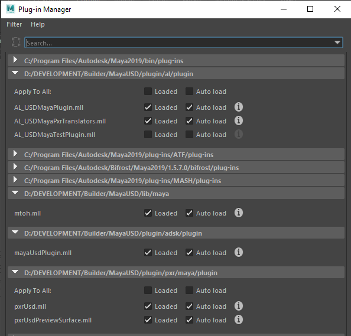

# MayaUSD
compiled PXR, AL and Autodesk USD libraries from Autodesk repo in https://github.com/Autodesk/maya-usd.

This version is intended to work only whith maya 2019

Before downloading this repo, you need to first download USD-CORE from https://github.com/ederjagreda/USD_20.08.

Once you cloned or download this repo, You need to create or update this User variable:

* MAYA_MODULE_PATH : 

    - ..\MayaUSD
    
    
Once  MAYA_MODULE_PATH is set, run maya and go to ```Windows -> Setting/Preferences -> Plug-in Manager``` to load the plugins as shown.

 


    
You cand find download material  like tutorials and assets to test USD in : http://graphics.pixar.com/usd/downloads.html
